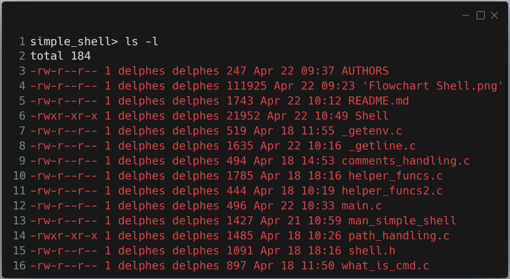

# holbertonschool-simple_shell

 
 
# 🛠️ A Simple Shell project

A Shell is an computer programm that gives an interface to the users to access to operating system services.
It allows the users to communicate with the exploitation system kernel to execute commands, run programs, manage files and processes, and automate tasks.

This project is a simple implementation of this interface, reproducing a few functions of it.

## 📖 Informations

This project was compiled with $ gcc -Wall -Werror -Wextra -pedantic *.c -o Shell on Ubuntu 20.04 LTS.

It is fully written in Betty coding standards.

## 🖥️ Installation

First, be sure to have:
 - GCC installed on your system.
 - Ubuntu 20.04 LTS (or equivalent).

This program was designed for Linux systems. It was tested functionnal on a Mac M2 (Apple Silicon) and can cause segmentation fault with this architecture.

You can install the simple shell by cloning this repo:
https://github.com/loufi84/holbertonschool-simple_shell

Next you can compile the files with this command:
gcc -Wall -Werror -Wextra -pedantic -std=gnu89 *.c -o Shell

Finally you can run our Shell writing:
./Shell

## ✏️ Output examples

## 📂 Files

 - shell.h : Contains function declarations and necessary includes.
 - main.c : Executes programs, verify the locations and handles all functions.
 - _getenv.c : Function to gets an environment variable.
 - _getline.c
 - _realloc.c

## 🗺️ Flowchart

Here is an overview of Shell's internal workflow:

## 🧑‍💻 Authors

- [Quentin Lataste](https://github.com/loufi84)
- [Delphine Coutouly-Laborda](https://github.com/Delphes1980)
- [Arnaud Lanoizele](https://github.com/arnaudlanoizele)
- [Chris Sodji Aleka](https://github.com/speedy-collab)

