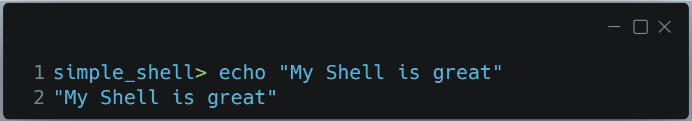
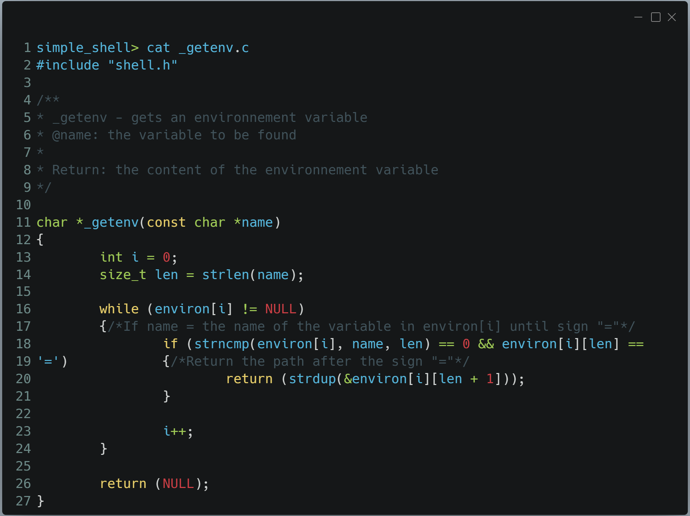

# holbertonschool-simple_shell

# 🛠️ A Simple Shell project

A Shell is an computer programm that gives an interface to the users to access to operating system services.
It allows the users to communicate with the exploitation system kernel to execute commands, run programs, manage files and processes, and automate tasks.

This project is a simple implementation of this interface, reproducing a few functions of it.

## 📖 Informations

This project was compiled with $ gcc -Wall -Werror -Wextra -pedantic *.c -o Shell on Ubuntu 20.04 LTS.

It is fully written in Betty coding standards.

## 🖥️ Installation

First, be sure to have:
 - GCC installed on your system.
 - Ubuntu 20.04 LTS (or equivalent).

This program was designed for Linux systems. It was tested functionnal on a Mac M2 (Apple Silicon) and can cause segmentation fault with this architecture.

You can install the simple shell by cloning this repo:
*https://github.com/loufi84/holbertonschool-simple_shell*

Next you can compile the files with this command:
_gcc -Wall -Werror -Wextra -pedantic -std=gnu89 *.c -o Shell_

Finally you can run our Shell writing:
*./Shell*

## ✏️ Output examples

## 🔍 Man page

This project contains a man page in the repository files.
You can directly run it in the shell doing :
*man ./man_1_simple_shell*

## 📂 Files

| Functions | Description |
| --- | --- |
| **shell.h** | Contains function declarations and necessary includes |
| **main.c** | Executes programs, verify the locations and handles all functions |
| **helper_funcs.c** | contains 5 functions: read_line (reads the prompt), split_string (split string into tokens), shutdown (handle the exit of the shell), print_env (handle the current environment), run_cmd (runs user's command) |
| **helper_funcs2.c** | 5 more functions: split_path (splits path of PATH), path_error (handles the inability to find a command), alloc_error (handles allocation error), path_handling (Resolves command path), what_is_cmd (check if the command is an absolute path or a built_in) |
| **helper_funcs3.c** | 5 more functions: _getenv (gets an environnement variable), expand_buffer (expands the buffer if needed), _getline (reads an entire line from stream), _realloc (Re-allocate a memory block), comments_handling (handles the comments) |
| **helper_funcs4.c** | 1 more function: is_numeric (checks if an arg is numeric) |
| **helpers_help.c** | contains 4 functions: shell_help (displays the shell's help page), help_help (display the help help page), help_exit (displays exit help page), help_env (displays env help page) |

## 🗺️ Flowchart

Here is an overview of Shell's internal workflow:

## 🧑‍💻 Authors

- [Quentin Lataste](https://github.com/loufi84)
- [Delphine Coutouly-Laborda](https://github.com/Delphes1980)
- [Arnaud Lanoizele](https://github.com/arnaudlanoizele)
- [Chris Sodji Aleka](https://github.com/speedy-collab)

